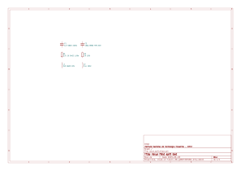

# Separating information from the `Value` field

The `Value` field contains the value for the component. Some people likes to
add extra information to R, L and C components. Typical examples are the
resistors tolerance, capacitor voltage, etc. This isn't recommended by KiBot
project. Instead we encourage adding this information in separated fields.

This example shows how to convert a schematic that uses extra information in
the `Value` field to a schematic that uses separated fields.

## Current limitations

- The current filter understands the most common attributes for resistors,
  inductors and capacitors. They are an extension of the
  [electro-grammar](https://github.com/kitspace/electro-grammar/) project.
  If some common attribute is not supported please consider explaining it
  in the [KiBot discussions](https://github.com/INTI-CMNB/KiBot/discussions).
- The option to replace the current value can't replace it using the original
  user style. Only a normalized representation.
- References must follow common practice guidelines. I.e. resistors uses R or
  RV when variable, capacitors uses C and inductors L.

## Example explanation

We'll you a simple example where we have the following components:

- C1: 1uF 0603 ±30%
- C2: 100p 0805 NPO 50V
- R1: 12k 1% 0402 1/8W
- R2: 1M 10%
- L1: 3n3 0603 10%
- L2: 1nH 100V

We want to replace the `Value` field by just the component value, and move the
extra information to additional fields. Note that you can keep the original
value.

The name of the fields to be used for the extracted information can be
configured using global options. Here is a list of the fields we can create
and the associated global option:

- **package**: package size in imperial style. I.e. 0805 (`field_package`)
- **power**: power rating for resistors (`field_power`)
- **temp_coef**: temperature coefficient for capacitors. I.e. X7R (`field_temp_coef`)
- **tolerance**: tolerance percent (`field_tolerance`)
- **voltage**: voltage rating (`field_voltage`)

Here is a table showing which attributes are currently supported for each
type of component:

  | package | power | temp_coef | tolerance | voltage |
--|---------|-------|-----------|-----------|---------|
R |    X    |   X   |           |     X     |         |
L |    X    |       |           |     X     |    X    |
C |    X    |       |     X     |     X     |    X    |

