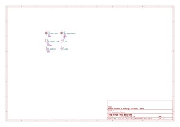

# Separating information from the `Value` field

The `Value` field contains the value for the component. Some people likes to
add extra information to R, L and C components. Typical examples are the
resistors tolerance, capacitor voltage, etc. This isn't recommended by KiBot
project. Instead we encourage adding this information in separated fields.

This example shows how to convert a schematic that uses extra information in
the `Value` field to a schematic that uses separated fields.

## Current limitations

- The current filter understands the most common attributes for resistors,
  inductors and capacitors. They are an extension of the
  [electro-grammar](https://github.com/kitspace/electro-grammar/) project.
  If some common attribute is not supported please consider explaining it
  in the [KiBot discussions](https://github.com/INTI-CMNB/KiBot/discussions).
- The option to replace the current value can't replace it using the original
  user style. Only a normalized representation.
- References must follow common practice guidelines. I.e. resistors uses R or
  RV when variable, capacitors uses C and inductors L.


## Example explanation

We'll use a simple example ([value_split.kicad_sch](value_split.kicad_sch))
where we have the following components:

- C1: 1uF 0603 ±30%
- C2: 100p 0805 NPO 50V
- R1: 12k 1% 0402 1/8W
- R2: 1M 10%
- L1: 3n3 0603 10%
- L2: 1nH 100V

[](Generated/sch_original.pdf)

We want to replace the `Value` field by just the component value, and move the
extra information to additional fields. Note that you can keep the original
value.

The name of the fields to be used for the extracted information can be
configured using global options. Here is a list of the fields we can create
and the associated global option:

- **package**: package size in imperial style. I.e. 0805 (`field_package`)
- **power**: power rating for resistors (`field_power`)
- **temp_coef**: temperature coefficient for capacitors. I.e. X7R (`field_temp_coef`)
- **tolerance**: tolerance percent (`field_tolerance`)
- **voltage**: voltage rating (`field_voltage`)

Here is a table showing which attributes are currently supported for each
type of component:

  | package | power | temp_coef | tolerance | voltage |
--|---------|-------|-----------|-----------|---------|
R |    X    |   X   |           |     X     |         |
L |    X    |       |           |     X     |    X    |
C |    X    |       |     X     |     X     |    X    |


## Example configuration for replace

We will generate a new schematic with the `Value` replaced and the extra
information in separated fields. This functionality can be achieved using
the **_value_split_replace** internal filter.

Here is a configuration [example](value_split_replace.kibot.yaml):

```yaml
kibot:
  version: 1

outputs:
  - name: value_split
    comment: "Split the Value and replace it"
    type: sch_variant
    dir: Modified
    options:
      pre_transform: _value_split_replace
      copy_project: true
```

This will generate a new schematic
[Modified/value_split.kicad_sch](Modified/value_split.kicad_sch):

[](Generated/sch_replace.pdf)

In this example you'll see the following:

- The new fields are visible, this is controlled by the `visible` option.
- The new fields are automatically placed, controlled by `autoplace` and
  `autoplace_mechanism` options.
- The R2 tolerance and L2 voltage fields looks wrongly placed. This is because
  the original file already contained these fields. KiBot won't move fields
  that are already defined.
- The new `Value` was replaced by a normalized representation. This makes them
  uniform and easy to read.
- **NPO** was replaced by **C0G**. KiBot will make things as uniform as
  possible. This means that things like **np0**, **COG**, **npO**, etc. will
  all be replaced by **C0G**.


## Example configuration no replace

A second internal filter covers the case where you want to extract the
information to new fields, but you don't want to change the visual aspect of
the schematic.

Here is a configuration [example](value_split_no_replace.kibot.yaml):

```yaml
kibot:
  version: 1

outputs:
  - name: value_split
    comment: "Split the Value"
    type: sch_variant
    dir: Modified_no_replace
    options:
      pre_transform: _value_split
      copy_project: true
```

This will generate a new schematic
[Modified_no_replace/value_split.kicad_sch](Modified_no_replace/value_split.kicad_sch)

It looks exactly the same as the original, but when you edit R1 you'll see:


## Example of customized configuration

Here we'll see an example where we want to avoid replacing the `Value`, but we
want to make the fields visible. We'll also change the name of the `temp_coef`
field to be `characteristic`.

Here is a configuration [example](value_split_custom.kibot.yaml):

```yaml
kibot:
  version: 1

global:
  field_temp_coef: characteristic

filters:
  - name: value_split_filter
    comment: 'Create fields from the value'
    type: value_split
    # [string='Value'] Name of the field to use as source of information.
    # source: 'Value'
    #
    # We can disable any of the generated fields
    # yes = overwrite existing value
    # no = don't touch
    # soft = copy if not defined
    #
    # package = 'yes'
    # power = 'yes'
    # temp_coef = 'yes'
    # tolerance: 'yes'
    # voltage = 'yes'
    #
    # The following options affects the resulting aspect
    #
    # [boolean=true] Replace the content of the source field using a
    # normalized representation of the interpreted value.
    replace_source: false
    # [boolean=true] Try to figure out the position for the added fields.
    # autoplace: True
    # [string='bottom'] [bottom,top] Put the new field at the bottom/top of
    # the last field.
    # autoplace_mechanism: 'bottom'
    # [boolean=false] Make visible the modified fields.
    visible: true

outputs:
  - name: value_split
    comment: "Split the Value"
    type: sch_variant
    dir: Modified_custom
    options:
      pre_transform: value_split_filter
      copy_project: true
```

This will generate a new schematic
[Modified_custom/value_split.kicad_sch](Modified_custom/value_split.kicad_sch):

[](Generated/sch_custom.pdf)


## BoM implicances

One of the reasons people puts all the information in the `Value` field is to
get all the information in the BoM. But this isn't needed when using KiBot
because you can join various fields in the same BoM column.

Here is a simple [configuration](bom_original.kibot.yaml) to generate the BoM
for the original schematic:

```yaml
kibot:
  version: 1

outputs:
  - name: 'bom'
    comment: "Bill of Materials in HTML format"
    type: bom
    dir: BoM_original
    options:
      columns:
        - Row
        - References
        - Part
        - Value
        - Quantity Per PCB
      format: HTML
```

It generates the following [BoM](BoM_original/value_split-bom.html)

And here is an [equivalent](bom_replace.kibot.yaml) for the schematic when we
apply the filter:

```yaml
kibot:
  version: 1

outputs:
  - name: 'bom'
    comment: "Bill of Materials in HTML format"
    type: bom
    dir: BoM_replaced
    options:
      columns:
        - Row
        - References
        - Part
        - field: Value
          join: ['package', 'voltage', 'tolerance', 'temp_coef', 'power']
        - Quantity Per PCB
      format: HTML
      pre_transform: _value_split_replace
```

Which generates an equivalent [BoM](BoM_replaced/value_split-bom.html)

Note that here we are applying the transformation to the original schematic.
In practice you should apply the transformation and then continue working with
the new schematic. In this case you no longer need to apply the transformation.
Well, as long as you continue using the new style.

## Workflow example

If you want to take a look at the workflow used to generate all the files in
this example please take a look at:
[workflows/update-value-split.yml](../workflows/update-value-split.yml)
